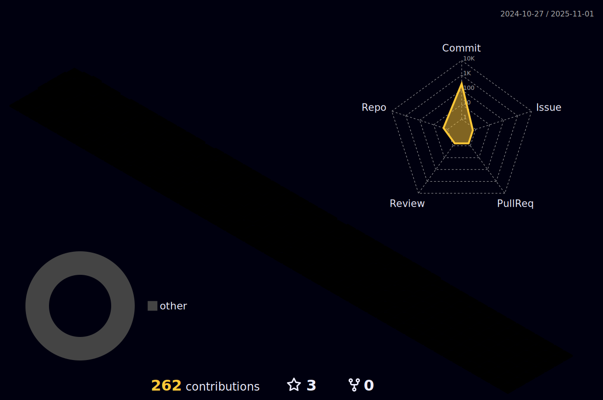

## 
<!--------------------------------------------------Título e Descrição-------------------------------------------------->

 
  
  

  

2025/01/24

##
<!--------------------------------------------------Status-------------------------------------------------->

 
  
  
  

 
  <a href="https://github.com/Infinity-gka">
  
  

    
  
    

<picture>
  <source media="(prefers-color-scheme: dark)" srcset="https://raw.githubusercontent.com/Infinity-gka/Infinity-gka/output/github-contribution-grid-snake-dark.svg">
  <source media="(prefers-color-scheme: light)" srcset="https://raw.githubusercontent.com/Infinity-gka/Infinity-gka/output/github-contribution-grid-snake.svg">
  
</picture>

 
##
<!--------------------------------------------------Proficiências-------------------------------------------------->

<h2>Languages:</h2>

  
  
  
  

<h2>Tools:</h2>

  
  
  
  
  

<h2>Operational Systems:</h2>

  

##
<!--------------------------------------------------Networks-------------------------------------------------->

 
    
  
  
  
  
  
  

